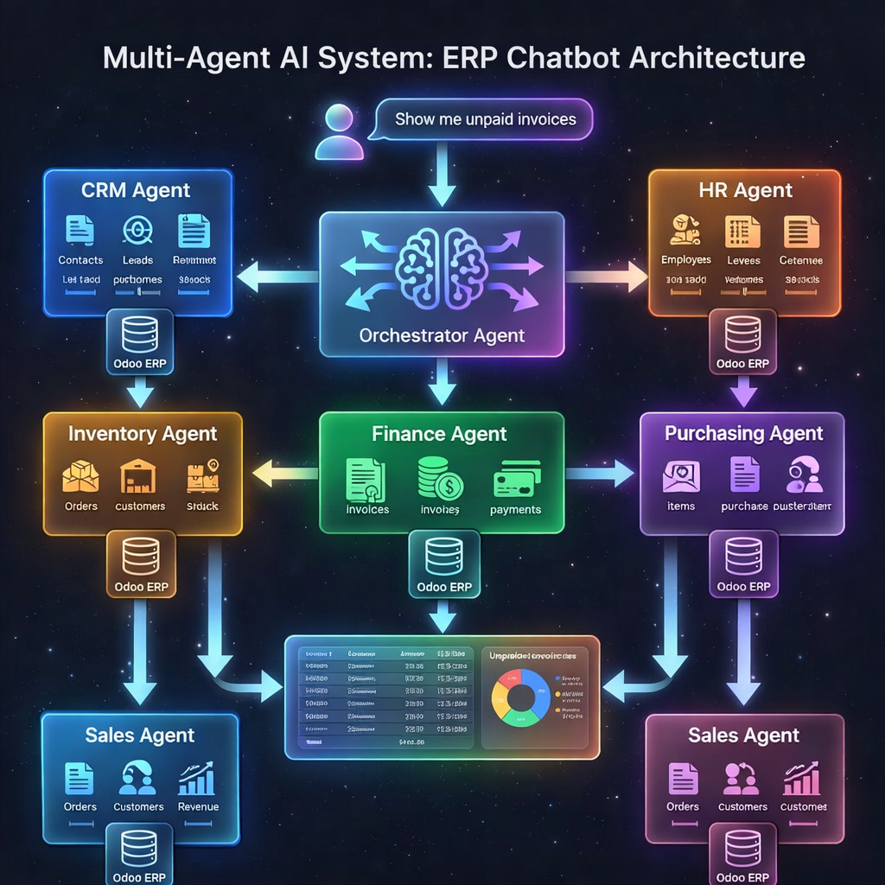

# 🤖 ERP AI Chatbot - Advanced Multi-Agent Intelligence System



## 🚀 Overview

**ERP AI Chatbot** is a state-of-the-art, multi-agent artificial intelligence ecosystem designed to bridge the gap between complex ERP data and natural language interaction. Built primarily for **Odoo ERP**, it transforms your business management experience by providing a conversational interface that doesn't just answer questions—it analyzes, reasons, and reports like a professional management team.

By leveraging the **Llama 3.3 70B** model via high-speed **Groq** inference, the system achieves near-instant response times with deep domain expertise across various business functions.

---

## 🧠 The Orchestrator: Central Intelligence

The core of the system is the **Orchestrator Agent**. Unlike traditional chatbots that use a single prompt for everything, our Orchestrator performs a **Preliminary Brain Analysis** on every user request:

1.  **Intent Recognition**: Identifies the primary goal of the user.
2.  **Domain Mapping**: Determines which specialized departments (Agents) are needed.
3.  **Confidence Scoring**: Weights the reliability of its decision (0-100%).
4.  **Parallel Dispatch**: If a query is multi-disciplinary (e.g., "Check stock for our best-selling items"), it triggers multiple agents simultaneously.

---

## 🛡️ Meet the Specialized Agents

The system features **6 autonomous agents**, each specialized in a specific business vertical with tailored system prompts and Odoo table access:

### � CRM Agent (Customer Relations)
*   **Focus**: Leads, Opportunities, Pipelines, and Conversion Rates.
*   **Actions**: Tracks the sales funnel, identifies high-probability deals, and reports on customer touchpoints.

### 👥 HR Agent (Human Resources)
*   **Focus**: Employee records, Attendance, Leaves, and HR Metrics.
*   **Actions**: Summarizes headcount, tracks daily absences, and provides department-based personnel distribution.

### 🧾 Purchasing Agent (Procurement)
*   **Focus**: Purchase Orders (PO), Vendors, and Item Procurement.
*   **Actions**: Monitors pending approvals, evaluates vendor performance, and tracks upcoming material arrivals.

### 💰 Finance Agent (Accounting)
*   **Focus**: Invoices, Payments, Cash Flow, and AR/AP.
*   **Actions**: Analyzes unpaid invoices, summarizes bank positions, and provides high-level financial health reports.

### 📦 Inventory Agent (Warehouse)
*   **Focus**: Stock Levels, Product Movements, and Replenishment.
*   **Actions**: Identifies "Critical Stockout" risks, monitors warehouse transfers, and provides individual product availability.

### 💼 Sales Agent (Commerce)
*   **Focus**: Quotations, Sales Orders, Revenue, and Customers.
*   **Actions**: Calculates monthly revenue trends, lists top-performing products, and manages customer relationships.

---

## ✨ Key Technical Features

- **🔍 Chain of Thought (CoT) UI**: Witness the AI's internal reasoning process step-by-step.
- **📊 Interactive Dashboards**: Real-time data visualization using Recharts.
- **⚡ Ultra-Low Latency**: Powered by Groq's LPU™ (Language Processing Unit) for sub-second analysis.
- **📥 Enterprise Export**: One-click professional report generation in **PDF** or **Excel (XLSX)**.
- **🔒 Enterprise Security**: Secure XML-RPC protocol for direct Odoo integration without middleware data storage.

---

## 🛠️ Technology Stack

| Layer | Technology |
| :--- | :--- |
| **Frontend** | Next.js 16 (App Router), React 19, TypeScript |
| **Styling** | Tailwind CSS, Framer Motion (Animations) |
| **AI Models** | Llama 3.3 70B (Orchestration & Specialized Analysis) |
| **Inference** | Groq API |
| **CRM/ERP** | Odoo XML-RPC API |
| **Reports** | jsPDF, Recharts, XLSX |

---

## 🚀 Installation & Setup

### 1. Prerequisites
- Node.js 18+ and npm
- A running Odoo Instance (or Odoo SH/Online)
- Groq API Key

### 2. Clone the Repository
```bash
git clone https://github.com/Seyfullah-KIZILKAYAA/erp_ai_cheatbot.git
cd erp_ai_cheatbot
```

### 3. Install Dependencies
```bash
npm install
```

### 4. Configure Environment
Create a `.env.local` file in the root directory:
```env
# Groq API Configuration
GROQ_API_KEY=gsk_your_key_here

# Odoo Connection Details
ODOO_URL=https://your-company.odoo.com
ODOO_DB=database_name
ODOO_USERNAME=user_email
ODOO_PASSWORD=api_key_or_password
```

### 5. Start Development Server
```bash
npm run dev
```
Open `http://localhost:3000` in your browser.

---

## 📈 Roadmap

- [ ] **Multi-Agent Collaboration**: Enabling agents to talk to each other to solve complex cross-departmental problems.
- [ ] **Autonomous Action Execution**: Enabling AI to create records (Quotations, Leaves, etc.) with user confirmation.
- [ ] **Voice Interaction**: Integration with Whisper for voice-to-command functionality.
- [ ] **Custom Agent Creation Tool**: A UI to build your own specialized agents for custom Odoo modules.

---

## 🤝 Contribution

Contributions are what make the open-source community such an amazing place to learn, inspire, and create. Any contributions you make are **greatly appreciated**.

1. Fork the Project
2. Create your Feature Branch (`git checkout -b feature/AmazingFeature`)
3. Commit your Changes (`git commit -m 'Add some AmazingFeature'`)
4. Push to the Branch (`git push origin feature/AmazingFeature`)
5. Open a Pull Request

## 📄 License

Distributed under the MIT License. See `LICENSE` for more information.

---
**Maintained by:** [Seyfullah KIZILKAYA](https://github.com/Seyfullah-KIZILKAYAA)
